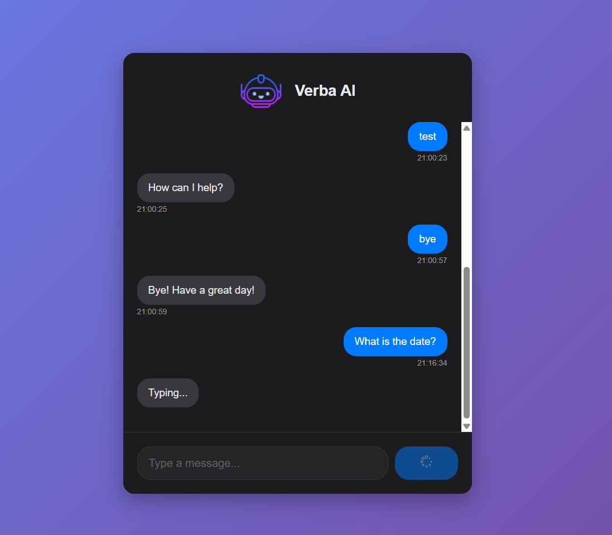
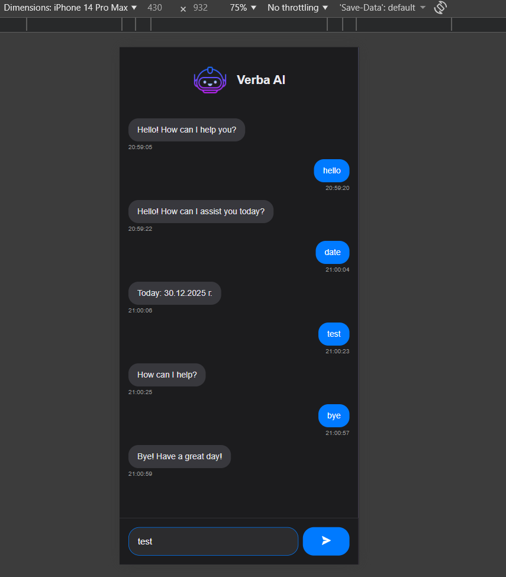

# Simple AI Chat Interface

Responsive AI chat interface for customer support with mock backend.

## Tech Stack
- **Frontend**: React 19, CSS (responsive design, dark mode), LocalStorage (persisting chat history)
- **Backend**: Node.js + Express, Rule-based mock AI (keyword matching), CORS 

## Quick Start

### 1. Clone the repository
```bash
git clone https://github.com/AngelRis/verba-ai-task.git
cd verba-ai-task
```
### 2. Run the Backend (Terminal 1)
```bash
cd backend
npm install
npm start
```
Backend runs on http://localhost:3001

### 3. Run the Frontend (Terminal 2)
```bash
cd frontend
npm install
npm start
```
Frontend runs on http://localhost:3000

## Features
- Clean and simple chat UI
- Responsive design (mobile-friendly)
- Dark mode support
- LocalStorage persistence of chat history
- Mock AI responses (rule-based keyword matching)
- Typing indicator (loading state)
- Message timestamps
- Basic error handling

## Integration with real AI agent
In production, the backend logic can be replaced with calls to a real AI service (OpenAI, or a custom ML model).  
The backend would forward user messages to the AI API and return the generated response.  
The frontend would remain mostly unchanged, as it already follows a service-based API communication pattern.

## Screenshots




