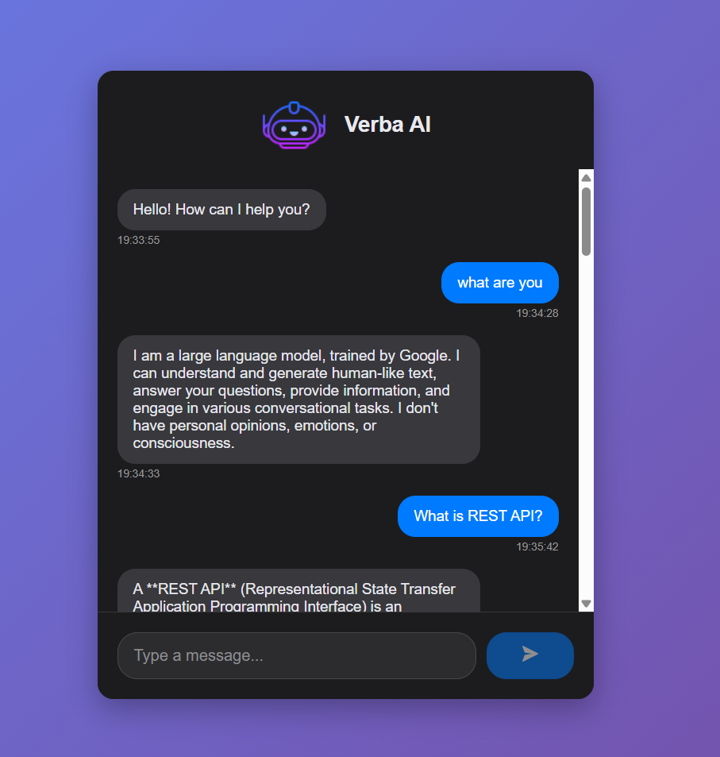
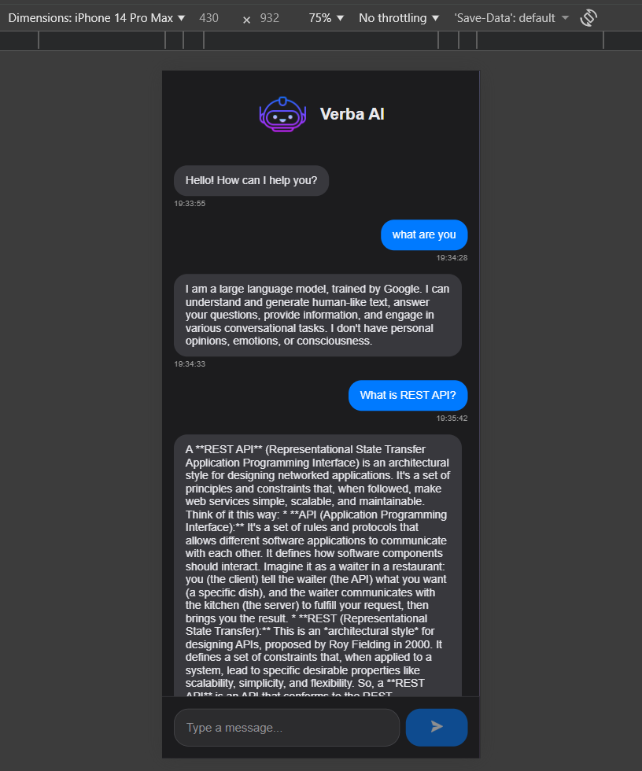

# Verba AI Chat Interface

Responsive AI chat interface for customer support powered by Gemini API.

## Tech Stack
- **Frontend**: React 19, CSS (responsive design, dark mode), LocalStorage (persisting chat history)
- **Backend**: Node.js + Express, Gemini 2.5 Flash API integration, CORS 

## Quick Start

### 1. Clone the repository
```bash
git clone https://github.com/AngelRis/verba-ai-task.git
cd verba-ai-task
```
### 2. Setup Environment Variables
Create a .env file inside the backend folder.  
Copy from .env.example and add your Gemini API key

### 3. Run the Backend (Terminal 1)
```bash
cd backend
npm install
npm start
```
Backend runs on http://localhost:3001

### 4. Run the Frontend (Terminal 2)
```bash
cd frontend
npm install
npm start
```
Frontend runs on http://localhost:3000

## Features
- Clean and simple chat UI
- Responsive design (mobile-friendly)
- Dark mode support
- LocalStorage persistence of chat history
- Real AI responses via Gemini API
- Typing indicator (loading state)
- Message timestamps
- Basic error handling


## Screenshots




